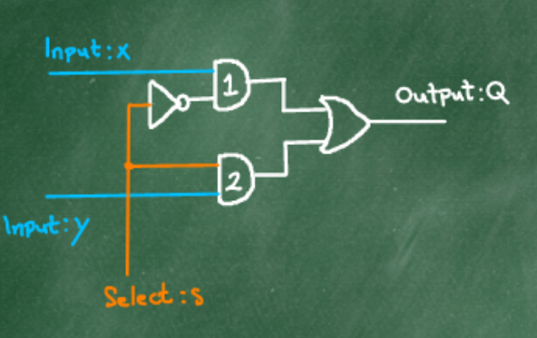
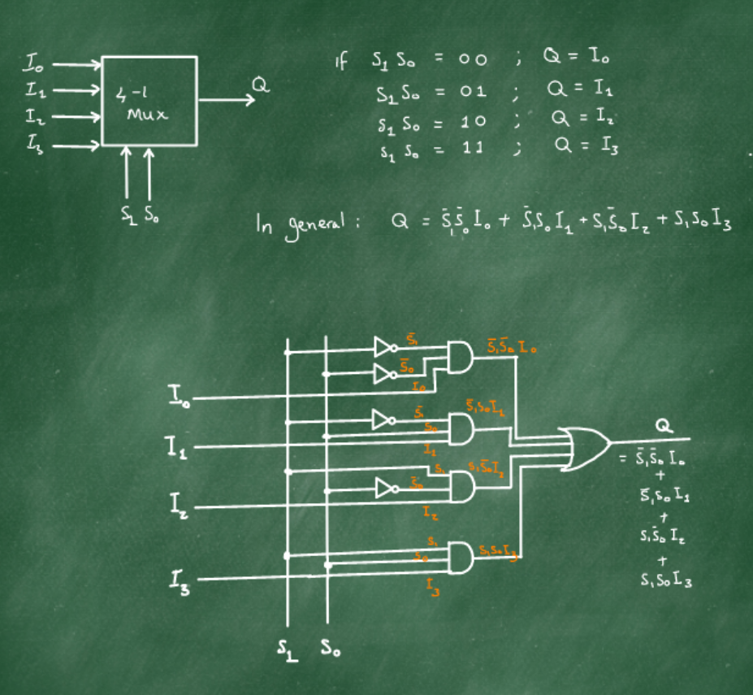

## Multiplexing
- Let's consider the selection circuitry of our implementation of the full-adder in more detail to understand it better and to generalise it.
- The circuit for selecting the carry out is called a **2-1 line multiplexer**

### 4 - 1 Multiplexer
- This requires 2 selectors

|S1|S0|Input|
|:-:|:-:|:-:|
|0|0|I0|
|0|1|I1|
|1|0|I2|
|1|1|I3|

#### In general, we can have 2^n -1 multiplexing, where 2^n is the number of inputs, n is the number of select lines and there is 1 output.

[Previous](5_2_20.md) | [Next](10_2_20.md)