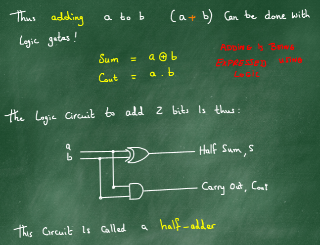

## Adding 2 Bits
### Understanding the problem
- Consider the two bits 0,1 and add them together in all possible combinations
    - 0 + 0 = 0
    - 0 + 1 = 1
    - 1 + 0 = 0
    - 1 + 1 = 10
- Every addition produces a **half-sum(s)** and a carry out **(cout)**.
- Reordering this information into two Truth Tables, we find out that :
    - The sum is in the form of XOR
        - | A | B |A `xor` B|
            |-|-|:-------:|
            | 0 | 0 | 0 |
            | 1 | 0 | 1 |
            | 0 | 1 | 1 |
            | 1 | 1 | 0 |
    - The carry out is in the form of AND
        - | A | B |A `and` B|
            |-|-|:-------:|
            | 0 | 0 | 0 |
            | 1 | 0 | 0 |
            | 0 | 1 | 0 |
            | 1 | 1 | 1 |
- Thus adding a to b (a + b) can be done with logic gates
    - Sum : A `xor` B
    - Carry out : A `and` B
#### Adding is being performed using logic.
- The circuit which executes this is called a **half-adder**.

### Looking more closely at the 'Carry' Process
- Decimal Example : 796 + 268

#### For multidigit addition we need to add three things 
- Input 1
- Input 2 
- Carry in
#### This will give 
- Sum
- Carry out

### Full Adders
- The circuit which a cycle of this is called a **full-adder**.
- We need to combine full-adders to make multidigit adders.
- We need *n* number of adders to create a *n* bit adder
- The Carry *ripples* through the circuit, giving the device its name

[Next](4_2_20.md)