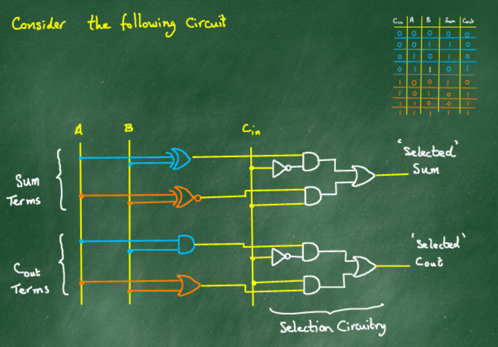

## Combining the 2 circuits which make up the Full Adder's logic
As seen previously, 
- When the Carry-In is 0 : 
    - The sum is a `xor` b
    - The carry is a `and` b
- When the Carry-In is 1 :
    - The sum is a `coin` b
    - The carry is a `or` b

#### The operation of the selection circuitry is based on the following two observations :

### 1. When an input to an `or` = 0, the output will be the same as the other input. We say that the output follows that input.
- | A | B |A `or` B|
  |:-:|:-:|:-------:|
  | 0 | (0) | 0 - The output follows A |
  | 1 | (0) | 1 - The output follows A |
  | (0) | 1 | 1 - The output follows B |
  | 1 | 1 | 1 |
- If I can **guarantee** that a certain input is 0, I know that the output will be the other input. 

### 2. When an Input to an `and` = 1, the output follows the other input.
- | A | B |A `and` B|
  |:-:|:-:|:-------:|
  | 0 | 0 | 0 |
  | (1) | 0 | 0 - Output follows B |
  | 0 | (1) | 0 - Output follows A |
  | 1 | (1) | 1 - Output follows A |

#### In both cases, we can *explicitly choose* one input and manipulate it to control how the output behaves with respect to the other input. 
#### The ability to choose different pathways through a circuit, depending on the value present at a particular point in the circuit at a particular time, is of fundamental importance in designing programmable machines.

[Previous](4_2_20.md) | [Next](10_2_20.md)